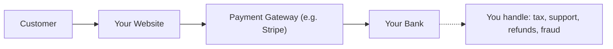
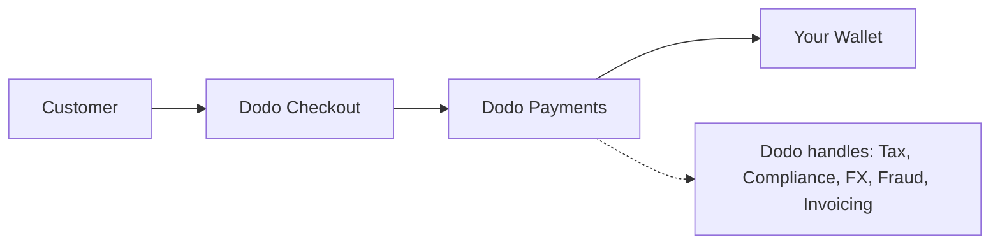

## Introduction

This guide compares the MoR model with the traditional Payment Gateway approach, helping you understand the advantages Dodo Payments brings to your business.

## The Core Difference

| Feature                          | MoR (Dodo Payments)         | Payment Gateway (Traditional PG)           |
|----------------------------------|--------------------------------------------|--------------------------------------------|
| Legal Seller                     | Dodo Payments (MoR)                        | Your Company                               |
| Tax Collection & Remittance     | Handled by Dodo                            | You are responsible                        |
| Compliance & Regulatory Burden  | Dodo assumes liability                     | You handle local laws and chargebacks      |
| Settlement Currency             | USD, EUR, INR, and 25+ others supported    | Depends on your merchant account           |
| Risk Management                 | Built-in fraud and chargeback protection   | You set up your own tools (e.g. Stripe Radar) |
| Payouts                         | Aggregated and simplified global payouts   | Direct from PG to you, with bank setup     |

## What It Means For You

With **Dodo as MoR**, we become the legal seller to your customers, allowing you to:

- Skip setting up local entities
- Avoid handling VAT, GST, or sales tax
- Offer more payment methods globally
- Reduce legal risk
- Launch faster in new markets

<Note>
Imagine selling a digital subscription to a user in France. With Dodo Payments, we collect the payment, file VAT with French authorities, and send you the net revenue. No tax headaches. No lawyers. Just growth.
</Note>

Additionally, the MoR model simplifies your entire back office. As your MoR, Dodo handles PCI compliance, fraud detection, currency conversion, and even customer billing support, freeing your team to focus on product and growth.

## Visual Comparison

**Revenue Flow: Payment Gateway**

**Revenue Flow: Merchant of Record (Dodo)**

## Why It Matters for SaaS & Digital Businesses

As your business scales, managing taxes, compliance, and global payment preferences can become overwhelming. With a payment gateway, you're responsible for:

- VAT/GST registration and filing in multiple jurisdictions
- Managing currency conversion and chargebacks
- Providing localized checkout and payment methods

With Dodo Payments as your MoR:
- You expand globally without setting up local entities
- Taxes are calculated, collected, and remitted on your behalf
- You gain access to a library of payment methods tailored to your customers
- We act as your legal buffer and operational partner

<Tip>
"Think of a payment gateway as a tunnel. Now imagine the Merchant of Record as a tunnel, train, driver, and ticketing staff all-in-one."
</Tip>

## Who Should Use MoR?

Dodo Payments is perfect for:
- SaaS & digital product companies
- Indie creators and solopreneurs
- Global businesses with customers across 100+ countries
- Companies who don't want to manage taxes & compliance in-house

If you're expanding internationally, selling subscriptions, or just want to reduce operational headaches, MoR is the smarter choice.

## When to Use a Payment Gateway Instead

There are cases where using just a payment gateway might make sense:
- Your business operates only in one country
- You already have internal finance and compliance resources
- You require complete control over customer billing experience
- You are highly cost-sensitive with thin margins at scale

<Note>
For many startups, using a gateway may suffice initially - but as complexity grows, switching to an MoR can save time, reduce risk, and accelerate international growth.
</Note>

## Why Choose Dodo Payments

Dodo Payments offers:
- All-in-one payments, tax, and compliance stack
- Real-time FX and multi-currency support
- Access to 30+ payment methods
- Seat-based billing, subscriptions, and one-time payments
- Automated tax handling in 150+ countries
- Built-in fraud prevention and PCI compliance

Whether you're a solo founder or a scaling SaaS team, Dodo simplifies the complexities of selling globally.

## Learn More

<CardGroup cols={2}>
<Card title="Adaptive Currency Support" icon="money-bill-wave" href="/features/adaptive-currency">
Learn how Dodo automatically presents prices in your customers' local currencies
</Card>

<Card title="Supported Payment Methods" icon="credit-card" href="/features/payment-methods">
Discover the 30+ payment methods available through Dodo Payments
</Card>
</CardGroup>

## Ready to Switch?

Join 3,000+ digital businesses using Dodo Payments to sell globally, without borders or bottlenecks.

<CardGroup cols={2}>
<Card title="Sign Up Free" icon="user-plus" href="https://app.dodopayments.com/signup">
Create your Dodo Payments account and start selling globally today
</Card>

<Card title="Talk to Sales" icon="envelope" href="mailto:founders@dodopayments.com">
Get personalized guidance from our team
</Card>
</CardGroup>

<Tip>
Let Dodo handle the hard stuff - so you can focus on building a great product.
</Tip>